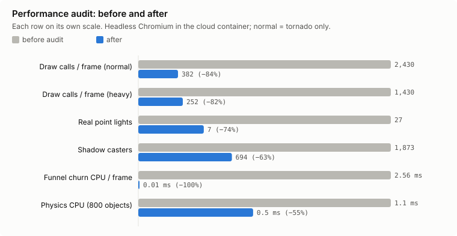
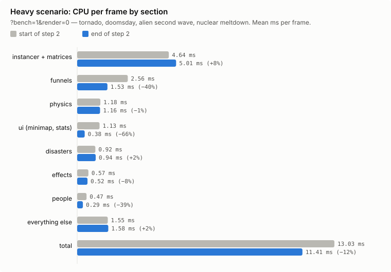
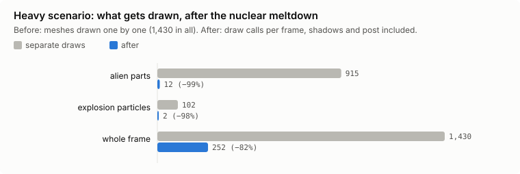

# Tornado Simulator — Findings and Project History

One file, two parts with different weight:

1. **Findings** (still valid): how to measure, the performance budget, the
   measured results, the key findings and the traps to avoid. Read this
   before touching anything on the hot path (`engine/perf/`, instancing,
   particles, lights, physics). Keep it updated with every measured change.
2. **History** (archive): decision snapshots as they were agreed, the
   completed roadmap and ideas never approved. It explains *why* things are
   the way they are; it may be stale and is never a source of current
   behaviour.

Where the current truth lives: the runtime code first; exact numbers and
contracts in `.claude/rules.md`; how the game plays in `GAME_DESIGN.md`;
open work, owed sound files and the feature backlog in `TODO.md`.

## Contents

- Part 1 — Findings
  - How to measure · Performance budget · Results
  - Measured changes: particle budget, the comprehensive pass, life-size
    scale, the giants, highway ramps and creature sounds, Black Hole Gun /
    flood / Bullet Time / Fire Gun, co-op
  - Key findings (the essentials) · Traps (do not do these)
  - Refactoring log · Next targets · Not measured yet
- Part 2 — History
  - Historical decision snapshots (controls, events, music, Hero Mode,
    aliens, giants, scale, performance, switched-off features, old bugs)
  - Archived roadmap (2026-09-30) · Unapproved future ideas (online, co-op)

---

## Part 1 — Findings

All figures come from headless Chromium in the cloud container (no GPU,
swiftshader), unless a line says otherwise. They compare runs with each
other. They are not what a player's machine will see: a laptop's CPU is
faster, and its GPU is untested (see "Not measured yet").

---

### How to measure

- **`?perf=1`**: a live panel in the corner of the game. It shows CPU per
  frame by section (heaviest first), draw calls, triangles, lights (lit /
  wanting), physics objects (and how many are asleep), the quality step
  and the heap. Anything over budget is shown in red.
  (`engine/perf/monitor.js`)
- **`?bench=1`**: a fixed scenario on a fixed step. It ends with one result
  on the page, in the console (`[bench] {...}`) and on
  `window.__tornadoBench`. The page keeps the last result per scenario and
  shows the change next to each figure. (`engine/perf/bench.js`)
  - `&scenario=heavy` (default): the tornado, doomsday at 2 s, the aliens'
    second wave at 8 s and a nuclear meltdown at 20 s.
  - `&scenario=normal`: the tornado only.
  - `&seconds=60`: how long the scenario runs.
  - `&render=0`: CPU only, the only practical way in the headless
    container.
  - `&scenario=hero`: Hero Mode, the tornado and a Terminator.
  - `&scenario=reset`: a busy run, reset half way through, then started
    again. It covers every system's reset.
  - `&seed=N`: a different random seed.
  - `&trace=1` / `&traceFrame=N`: find where two runs diverge.
- **Reproducible.** The same code and seed give the **same fingerprint**
  (objects, damage, collapses, people, aliens, a position checksum). A
  refactor that only moves code must leave the fingerprint unchanged. That
  is the safety net for the refactoring.
  - Verified: two 60 s heavy runs gave `866/1184477/571/78/0/33/-3107.35`
    both times, and three 15 s runs also matched.
  - Run-to-run CPU noise is about ±5%.

### Performance budget

Defined in `engine/perf/budget.js`. It is set just above the current
measurements, so a regression shows up as a FAIL.

| What | Budget | Measured now |
|---|---|---|
| CPU mean, heavy scenario (container) | 12 ms | 11.4 ms |
| CPU mean, normal scenario (container) | 11 ms | 10.1 ms |
| CPU p99, heavy scenario | 25 ms | 22 ms |
| Draw calls per frame (shadows and post included) | 400 | 252 (heavy, after the meltdown) |
| Real point lights | 6 (+1 for lightning) | 6 |
| Heap growth | 2 MB/s | not measurable headless |
| Per-frame allocations in hot paths | none | none (see traps) |

The "measured now" column is from the performance audit (2026-09-30). The
comprehensive pass that followed brought the heavy scenario to about
6.1-6.6 ms (see "The comprehensive pass" below); the budget was not
tightened since.

Anything new has to fit in the budget. If it does not, something else has to
be made cheaper first.

### Results

| Metric | Before audit | After |
|---|---|---|
| Draw calls per frame, normal | ~2,430 | 382 |
| Draw calls per frame, heavy (after the meltdown) | 1,430 meshes drawn one by one | 252 |
| Real point lights | 27 | 7 |
| Shadow casters | 1,873 | 694 |
| Funnel churn CPU | 2.56 ms (at 30 Hz) | ~0 (vertex shader) |
| Physics CPU, ~800 objects | 1.1 ms | 0.5 ms |

The "heavy" section figures come from `?bench=1&render=0`, as the mean ms per
frame. "Before" is the 30 s run at the start of step 2; "after" is the 60 s
run at the end of it.

| Section | Before | After |
|---|---|---|
| instancer + world matrices | 4.64 | 5.01 |
| funnels | 2.56 | 1.53 |
| physics | 1.18 | 1.16 |
| ui (minimap, stats panel) | 1.13 | 0.38 |
| disasters | 0.92 | 0.94 |
| effects | 0.57 | 0.52 |
| people | 0.47 | 0.29 |
| everything else | 1.55 | 1.58 |
| **total** | **13.03** | **11.41** |

`render=0` does not count the render call's own CPU. What instancing saves
(one draw call instead of hundreds, and far fewer objects for three.js to
sort and cull) therefore does not show in these figures. The instancer's
side of that trade (copying matrices) does show, which is why "instancer"
went up by 0.4 ms while the frame drew about 1,200 fewer objects.

#### Particle budget (engine/perf/caps.js)
- The effects that exist use a lot of particles: about **5,000** drawn at
  12 s into the hero scenario, and a peak of **6,791** in the heavy
  benchmark (`particlesMax` in the `?bench=1` result).
- The shared budget is **10,000**, which leaves at least ~3,200 for the new
  effects in the worst moment.
- Counting what is in use is done every 4th frame, over every tracked pool.
- Enemies are capped at 160 in all, and Patient Zero's clones at 50.
- **With the fuel stations (PR 1a)**, whose three pools (spray 500, flames
  700, smoke 900) ask `particleRoom()` before every emission, the peaks are
  (`particlesMax`): heavy 60 s **7,220**, hero 40 s 7,386, works 40 s 7,538,
  landing 75 s 7,454, storm 40 s 7,753, reset 25 s 7,923. All under the
  10,000 budget.
- The fingerprints changed in every scenario with that step, as they must:
  the stations now leak and go up when a funnel reaches them, and the cars
  round a tanker go up after it. Two heavy runs gave the same fingerprint
  (determinism kept). New references:
  heavy 60 s `855/1280474/572/84/0/54/7637.52`,
  hero 40 s `666/775443/254/88/91/10/6867.55/hero 0 68.18`,
  storm 40 s `627/540718/316/79/3/8/12861.05`,
  landing 75 s `809/582820/346/79/81/8/39985.23/ship down 0.0,0.0`,
  works 40 s `699/712013/288/88/87/6/14780.25`,
  reset 25 s `417/223723/32/67/100/10/5869.47`.

#### The comprehensive pass (three r186, matrix walk, swirl)

Measured with `?bench=1&render=0` (mean CPU ms per frame, 60 s heavy and
40 s hero), before and after each step:

| Step | heavy | hero | instancer (heavy) |
|---|---|---|---|
| Start (three 0.160, main after PR 10) | 7.23 | 6.96 | 2.88 |
| Hidden subtrees skipped in the matrix walk, swirl loop tightened | 6.15 | 5.68 | 2.28 |
| three 0.160 → 0.186.1 (Timer, no other change) | 6.08 | 5.80 | 2.04 |
| With the cows (8 cows, 48 meshes and a fence) and the sharks | 6.56 | 5.84 | 2.34 |

- **Hidden subtrees** (engine/matrices.js): about 700 of the scene's ~3,750
  objects sit under something hidden (pools waiting, spare variants, lamps
  off). three draws nothing under a hidden object, so their world matrices
  are no longer rebuilt; the subtree is rebuilt whole the frame it is shown
  again. The fingerprints did not change with it.
- **The swirl loop** (vortex/particles.js): the per-frame constants are
  worked out once rather than per particle, and funnelRadiusAt is inlined
  with the same arithmetic. Fingerprints unchanged.
- **`renderer.debug.checkShaderErrors`** is now off outside `next dev`:
  `getProgramInfoLog` was 9.2% of a heavy run's CPU in the profile (every
  new material compile asks the driver for its log). It does not show in
  the bench (which runs under `next dev`), only in production builds.
- **three 0.186.1**: `THREE.Clock` is deprecated (r183), replaced by
  `THREE.Timer` connected to the Page Visibility API (no huge step when a
  tab comes back). No other API the game uses changed.
  **The fingerprints change with the upgrade** although nothing in the game
  did: three draws every object's `uuid` from `Math.random`, which the
  bench seeds, and r186 makes a different number of internal objects, so
  the seeded stream is shifted. New references (with the cows and sharks):
  heavy 60 s `866/1175337/571/77/0/33/725.65`,
  hero 40 s `662/767737/254/89/74/10/4998.66/hero 0 14.76`.
  Particle peaks: heavy 7,133, hero 7,551 (budget 10,000).
- Still to do: a building's interior is walked every frame though it
  almost never moves. Marking intact buildings static was tried on paper
  and left: too many systems (fire, sinking, shaking, the chasm) move a
  part of an intact building without changing its damage state.

#### Life-size scale (docs/SCALE.md)

People went from 5.5 m to 1.8 m. Buildings went to real storeys, and the
funnel's default radius from 20 m to 30 m. CPU per frame
(`?bench=1&render=0`, same container, mean ms):

| Scenario | Before | After |
|---|---|---|
| heavy 60 s | 4.90 | 5.08 |
| hero 40 s | 4.87 | 5.00 |

The fingerprints change with it, as they must: every building, the funnel
and the crowd changed size. New references:

- heavy 60 s: `781/1170844/450/77/0/30/30373.41`
- hero 40 s: `506/615707/51/78/99/8/5062.76/hero 0 40.47`

Particle peaks: heavy 7,327 and hero 7,455, against a budget of 10,000.

#### The giants (Yeti, T-Rex, their stalemate), 2026-10-01

The Yeti and the T-Rex are now 15 m and 18 m, with the Yeti's cold gun and
the 15 s stalemate between them (`engine/giants/clash.js`). A new bench
scenario, `&scenario=giants`, calls both in with the storm up: they close
on each other and clash, flame against frost, within the run.

`?bench=1&render=0`, same container, mean ms:

| Scenario | Before (80f3b14) | After |
|---|---|---|
| heavy 60 s | 4.72 | 4.80–5.09 (three runs) |
| hero 40 s | 4.77 | 4.93–5.09 (three runs) |
| normal 50 s | — | 4.94 |
| giants 50 s | — | 5.14, particles 8,486 at the peak |

So both giants and the clash cost about 0.2 ms of CPU over the same town
without them, and stay under the particle budget (10,000). The fur is one
instanced mesh per moving part (four draws for ~1,000 strands).

The fingerprints change: the new systems make their meshes, materials and
pools at start-up, and three.js draws a UUID for each from Math.random,
which the bench has seeded -- everything after is shifted. (The cold gun's
canvas textures use a random generator of their own, so they add nothing.)
New references:

- heavy 60 s: `758/1159147/450/77/0/17/32215.28`
- hero 40 s: `568/693392/92/102/106/4/1428.95/hero 0 29.98`
- giants 50 s: `914/557453/295/68/53/6/-19529.61`

The camera's glide to a new character does not run under the bench
(`ctx.benchmarking`): the hero scenario presses 🤖 Terminator.

#### Highway ramps and creature sounds, 2026-10-01

`?bench=1&render=0`, mean ms, after both: giants 50 s 5.23 (5.14 before),
hero 40 s 4.89, heavy 60 s 5.18 -- within run-to-run noise. The creature
sounds cost a distance check per sound asked for; the swarms are held back
by each kind's minimum gap before any audio node is made. New fingerprints
(the highway's new spans and the sounds' random draws shift them):

- heavy 60 s: `776/1118921/436/74/0/21/18873.97`
- hero 40 s: `512/627492/53/83/99/8/-480.95/hero 0 38.21`
- giants 50 s: `793/510118/257/71/57/10/6593.67`

#### Black Hole Gun, opaque flood, Bullet Time, Fire Gun, 2026-10-01

Measured on the production build (`next start`), `?bench=1&render=0`,
against the previous commit (fb10348) built and run the same day on the
same machine -- this container ran ~40% slower than the session above, so
the earlier figures are not comparable:

| scenario | before (fb10348) | after | |
|---|---|---|---|
| hero 40 s | 7.22 ms (p99 14.2) | 7.41 (13.6) | noise |
| giants 50 s | 7.41 (13.7) | 8.06 (16.2) | the smaller Yeti closes differently |
| heavy 60 s | 8.81 (18.1) | 8.48 (16.3) | noise; no auto meteors/quake now |
| hole 60 s (new) | — | 4.40 (11.9) | flood + black hole + Yeti at once |

The new `hole` scenario is test 8 of the request: the dam break's surge and
flood with a black hole opened in its path and the Yeti called into it.
Its frame stays well inside 16.7 ms on the CPU. The GPU side (the opaque
water's two meshes, the hole's 1400-fragment and 320-streak instanced
meshes, 300 bullets) is not measured here (no GPU in the container).

New fingerprints (the scheduled meteors and earthquake are gone, the Yeti
is smaller, the minigun has 200 rounds):

- heavy 60 s: `780/758329/436/85/0/47/24974.71`
- hero 40 s: `762/702989/282/100/96/10/-23655.17/hero 0 -26.33`
- giants 50 s: `872/371348/295/69/61/10/-4986.09`
- hole 60 s: `409/230219/91/110/62/8/16629.97`

#### Co-op multiplayer (2 players), 2026-10-02

Measured/derived, not a GPU benchmark (the container has none):

- **Network.** A snapshot at the per-kind cap (64 rows in each of players,
  tornadoes, Terminators, aliens, ships, vehicles) is ~11 KB of JSON, about
  162 KiB/s at the approved 15 Hz; the relay frame limit is 64 KiB. Typical
  snapshots (a handful of rows) are well under 1 KB. Peer inputs are ~150 B
  at 30 Hz.
- **Entity and particle caps (R-048) are untouched.** The guest is one
  `createPerson` figure on the host (never in `Sim.objects`, no pooled
  entities, no particles); the peer's proxies are plain meshes (<=64 per
  kind, shared geometry and materials, disposed with the session). No cap was
  raised. The 160-enemy and 10,000-particle budgets are not affected: the
  guest's shots go through the existing enemy registry.
- **Per-frame cost on the host** is one pass over the registered enemies per
  guest shot, one pass per frame for the catch test, and the snapshot build
  every ~67 ms. No allocation in the hot enemy/`Sim.objects` loops; the
  snapshot and the guest's input objects are the only per-tick allocations.
- **Known limits.** The guest carries the whole weapon wheel (rifle, minigun,
  railgun, Fire Gun, Black Hole Gun, Katana; the Katana is a simple arc cut
  through the 'blade' hit, not Roger's full slash/Blade Mode); EMP and Time
  Slow are host-only
  (time is host-authoritative). Aliens target Roger, not the guest. The
  peer's local simulation stays idle and draws the host's world as proxies,
  so cars thrown by the storm appear as proxy boxes beside their (static)
  local originals. Seed-matching covers town construction only; runtime
  gameplay randomness is not shared.

#### Co-op mirror: bytes per new snapshot kind (estimates, not measurements), 2026-10-10

Derived from the row widths in `net/protocol.js` (`EXTRA_ROW_WIDTH`) and the
plan's done notes; nothing was measured over the relay yet (the `?netdebug`
read-out is still owed, `TODO.md`). All kinds are additive and optional, built
only with a guest in the room, keys omitted when nothing exists. At 15 Hz:

- `fx`: about 60 B a row, cap 24, so at most about 1.5 KB a snapshot (about 22 KB/s).
- `giants`: about 40 B a row, 40 to 85 B a snapshot (0.6 to 1.3 KB/s).
- `replicator` and `clones`: 39 B original, about 37 B a clone; 50 clones about 1.8 KB (about 27 KB/s worst case).
- `figures`: about 42 B a row; 10 samurai about 420 B; worst case 14 rows about 590 B (8.8 KB/s).
- `flyers`: about 41 B a row; herd and helicopter 387 B (5.8 KB/s), with 3 jets 519 B, 14 rows about 600 B (9 KB/s).
- `fires`: typical blaze about 685 B (10 KB/s); 64-row worst case about 2.5 KB (38 KB/s).
- `flood`: about 35 B while a flood lasts (0.5 KB/s). `quake`: 33 B alone, 240 B with every part (3.6 KB/s).
- `storm`: about 28 B (0.4 KB/s). `firenado`: about 22 B for 13 s (0.3 KB/s). `meteor` fx rows: about 44 B once per rock.
- `tw`, `hole`, `aim`, `env`, `cars`: no estimate was recorded in the plan.
- Building damage (not built): at most about 250 changed rows a run (about 2 KB) plus a full table of about 290 B every 2 s; 4.4 to 7.4 KB/s if sent every tick.

Every worst case stays under 4 percent of the 64 KiB frame; the 162 KiB/s worst case of the 2026-10-02 note is the bound that still matters.

### Key findings (the essentials)

1. **The funnel's surface noise was the single biggest CPU cost** (half a
   frame at the start). It now runs on the GPU (`engine/funnelChurn.js`),
   and the CPU only sets about 20 numbers per frame. It is also smoother:
   it used to redraw at 30 Hz and now updates every frame.
2. **Draw calls come from things built out of many small meshes**: people
   (6 parts), trees (2), cars (9), aliens (14–17), building walls, and
   explosions (7 objects each). Instancing, one InstancedMesh per kind of
   part, is what took the draw calls from thousands down to hundreds. After
   a nuclear mutation the aliens alone were 915 draws, and are now 12.
3. **Explosion particles now share two pools** (`particlePool.js`, with
   size and alpha per particle) instead of 3 Points per explosion: 102 draws
   became 2.
4. **The real lights are shared** (`lightPool.js`): effects ask for a
   light, and each frame the 6 that matter most near the camera get real
   ones. Adding or removing real lights recompiles every material.
5. **Physics sleep**: about half of a busy town's objects are at rest at
   any moment, and skipping them halved the physics cost.
6. **World matrices**: rebuilding only what moved matches three.js exactly
   (checked on all 4,316 objects). What is left of the cost is the walk
   over ~3,500 objects: about 0.3 µs each, because the objects come in many
   different shapes (megamorphic property access).
7. **Each explosion's sound used to fill fresh noise buffers**: 60,000 to
   125,000 random numbers per explosion, several explosions a second. The
   buffers are now made once and shared (`sound/thunder.js
   createShortNoiseBuffer`).
8. **The minimap redrew every frame** (1.2 ms). It now redraws at 20 Hz. The
   stats panel now writes to the DOM only when a value changes.
9. **The sound had its own effect on the game's randomness.** Sounds that
   play or not depending on the audio clock, or on a sample having loaded,
   used to draw from `Math.random`, so two identical runs diverged. Sound
   now has its own generator (`sound/random.js`).

### Traps (do not do these)

- **`Object3D.lookAt` for a camera pose.** An ordinary object turns its +z
  to the target; a camera looks down its -z. A quaternion taken from a
  plain Object3D aimed the glide's camera exactly backwards
  (`engine/camera.js`). Use `Matrix4.lookAt(eye, target, up)` (the camera
  convention) and `setFromRotationMatrix`.
- **A new system's random numbers at start-up** shift the seeded bench
  (three.js draws every UUID from Math.random), so any new mesh or material
  changes the fingerprint. Expected for a feature; for something meant to
  change nothing (a refactor), build the same objects in the same order.
- **Stepping THREE.Timer on requestAnimationFrame's timestamp.** That
  timestamp is when the frame began; after a long start-up it is earlier
  than the first, direct call to animate, so the first step is negative.
  A negative dt run through the funnel's rope-out *grew* it (birth 3 before
  Start, with the town being wrecked while "standing by"). Step it with
  `update()` (performance.now) and clamp dt at 0 (tornadoEngine.js animate).

- **No `new THREE.Vector3()` (or any allocation) in anything that runs every
  frame or per object.** Use scratch vectors, and pass an `out` vector.
- **No `performance.now()` / `Date.now()` in simulation code.** Use
  `ctx.now()` (the real clock in the game, the fixed clock in the benchmark).
  Otherwise the benchmark stops being reproducible.
- **No `Math.random()` in sound code.** Use `soundRandom()` /
  `soundRandFloat()` from `sound/random.js`. `THREE.MathUtils.randFloat`
  counts as `Math.random` too.
- **Every `addEventListener` passes `{ signal: ctx.signal }`** (the engine's
  lifetime, aborted in `dispose()`). Without it, a remount (React StrictMode
  in dev, or leaving the page in the Luigi shell and coming back) left the
  disposed instance answering the panel's buttons: Reset also reset the dead
  instance and threw (`meteors.js createMeteor`). This was found by the
  benchmark's `reset` scenario.
- **No new real lights.** Use `lightPool.createLight` or `requestLight`.
- **Small parts should not cast shadows** (limbs, wheels, trim, poles,
  hats).
- **A new thing made of many meshes** (a new creature or vehicle) should go
  through the instancer, or be justified with a number from `?bench=1`.
- **Many separate `Points` or `Sprite`s for an effect**: use a shared
  `particlePool`.
- **Redrawing DOM or canvas UI every frame**: throttle it, or write only
  on change.
- **A short benchmark (`seconds` below the 2 s warm-up) used to measure
  nothing and hang its caller.** It now measures the second half and always
  ends with a result or an error on `window.__tornadoBench`.
- **Comparing benchmark numbers across sessions.** The container's speed
  varies by tens of percent from one session to the next. Build the
  previous commit in a `git worktree` and run both the same day.
- **Clipping planes need `renderer.localClippingEnabled`** and a material of
  their own: the black hole's dissolve clones a building's materials (they
  are shared across the town), and puts the originals back when it is done.
- **An effect sized for a giant, fired from the camera**, fills the screen:
  the Fire Gun uses the T-Rex's flames at 0.42 of their size and 0.55 of
  their alpha.
- **Headless checks**: never run a real-time rendered loop in swiftshader
  (a few fps: minutes per check). Run `?bench=1&render=0`, then render
  **one** frame if a picture is needed.

### Refactoring log

- **`aliens.js` and `heroMode.js` were split into folders** (`engine/aliens/`,
  `engine/hero/`), each file now under 720 lines. The code was only moved:
  a scope-analysis tool rewrote the references into `S.x` (shared state) and
  `api.fn` (the other modules' functions), and the `?bench=1` fingerprints
  are identical before and after (heavy, hero).
- **Every file over ~900 lines was then split the same way** (vortex,
  electricStorm, fissure, powerLines, spaceship, meteors, peopleMotion,
  gasMains, flood, factory, viaduct, damage, terminator). Each became a
  folder with its tunables and shared types in `config.js`. The largest file
  left in any of them has 824 lines.
  - Every split was checked against a scenario that runs that code
    (`heavy`, `storm`, `landing`, `works`, `hero`), with identical
    fingerprints before and after.
  - Still over 800: `tornadoEngine.js` (1,543 lines: it builds and
    registers every system, and the frame; the next candidate, to be split
    into construction and the frame), and `chasm.js`, `vortex.js`,
    `nuclear.js`, `ui/minimap.js` at 808–827 lines.
- **Lifecycle registry** (`engine/lifecycle.js`): every system goes through
  `register()`. New systems use `{ auto: true }`. The audit found
  `clearSpeechBubbles` documented as called "on reset" but never called,
  so the old crowd's speech bubbles survived a Reset. The heavy fingerprint
  is unchanged.
- **Event bus** (`engine/events.js`, on `ctx.events`): `announce`,
  `notice`, `empPulse` and `rogerKill` are now emitted instead of 14 direct
  calls into Hero Mode and Smooth Criminal from 11 files (mothership,
  nuclear plants, UFO, hunters, EMP, Electric Tornado, lightning, car
  rescue, minigun, railgun, plasma). The hero fingerprint is unchanged.
- **Type checking** (`// @ts-check`, JSDoc, `jsconfig.json`,
  `types.d.ts`): `npx tsc -p jsconfig.json` checks 108 of the 140 files, and
  a wrong argument in any of them now fails it (tried: an extra argument
  was caught as TS2554).
  - Making them pass meant documenting what had drifted: fields added to
    aliens and to `SimObject` over time and never written into their
    types, and the shared types now visible across files.
  - Still unchecked (156 errors in 32 files, mostly JSDoc unions missing
    states added later, like `'muster'` and `'strain'`, and inference that
    loses tuples). Clean them a file at a time and add `// @ts-check`:
    PwaSupport.js, TornadoSimulator.js, aliens/crew.js, chase/carRescue.js, chase/index.js, chasm.js, clouds.js, context.js, damage.js, downburst.js, earthquake.js, electricStorm.js, emergency/index.js, environment/backdrop.js, environment/blockers.js, environment/buildings.js, environment/fuelStation.js, environment/peopleMotion.js, environment/powerLines.js, environment/tanker.js, environment/train.js, environment/viaduct.js, firenado.js, fissure.js, flood.js, heroMode.js, possess.js, sound/cues.js, terminator.js, ui.js, vortex.js, tornadoEngine.js.
  - three ships no types. `@types/three` would check the three.js calls
    too, but it is a new dependency, so it has not been added.
- **Listener leak** (see Traps): found by the `reset` scenario and fixed
  for all 59 listeners at once.

### Next targets (measured, not done yet)

- **The world-matrix walk (~1.6 ms with nothing moving, ~4–5 ms in the heavy
  scenario).** Idea: skip subtrees that are known to be static, such as
  building interiors and the backdrop, with a version number on the parent.
- **The funnel's swirl particles** (most of the remaining ~1 ms in
  "funnels"; the loop was tightened in the comprehensive pass): the same
  move to the GPU as the surface.
- **Explosion fireball and shock-ring sprites** (4 draws per explosion, for
  under half a second each): a shared instanced billboard.

### Not measured yet

- **A real GPU, and a real phone.** The container has no GPU. Open the game
  with `?perf=1` on the phone (with `next dev -H 0.0.0.0` on the LAN) and
  read the fps and draw figures. Run `?bench=1` for a CPU number that can
  be compared.
- **Heap growth**: `performance.memory` does not update in headless Chrome.
  Measure it in a desktop Chrome with `?perf=1`.

---

## Part 2 — History

> Archive: these entries record what was agreed or reported at the time.
> They are kept as an audit trail and may not describe the current build.

### Historical decision snapshots

The entries below record what was agreed or reported at the time they were written. They are retained as an audit trail and are not guaranteed to describe the current build.

#### Controls, Bullet Time, the Fire Gun (2026-10-01, on request)
- **W A S D everywhere**, the arrow keys removed (no fallback): Hero Mode,
  the car, Chase Mode, Control Tornado, the Landing ship, the free camera.
  Q Time Slow, E Teleport, R EMP. In a car E/Q/Esc get out (abilities are
  off while driving).
- **Time Slow lasts 7 s**; Q again ends it early. **With the minigun in hand
  it is Bullet Time** (Roger's proposal, built as he described it): the
  world at 3%, the minigun's bullets (real ones now, hero/bullets.js:
  brass, glowing tip, tracer, casings, sparks, instanced, 300 at most)
  hanging in the air -- those fired during it fly 5 m first -- then all
  going on together when it ends; the picture drained and vignetted, the
  camera drifting round Roger, the sound muffled with a time-warp in and a
  whoosh out.
- **Fire Gun** on the wheel: the T-Rex's fire (same particles at a man's
  scale, same sound, same burning), no energy. The **only** weapon that
  hurts the Cyber Yeti (fire only; an EMP stuns it); it burns aliens too.
- **Mega beam: 2 s** of charge (was 3). **Railgun: yellow.**
- **The minigun keeps its rules** (people and Terminators, 30 rounds a
  Terminator; the register enemies that take bullets), 200 rounds.

#### Scripted events and the black hole (2026-10-01, on request)
- **Nothing chains by itself.** Starting the tornado sets off no other
  disaster: the scheduled meteor barrage (25 s), the rock aimed at the dam
  and the automatic earthquake (90 s) are gone, and the waterspout no
  longer breaks the dam. Meteors start only from their button, at random
  spots; the Dam Break only from its button. Doomsday's script still calls
  them itself. (The tanker's and the chemical works' fuses are set pieces of
  their own, not disasters, and stay.)
- **The flame "tornado" after shooting a tanker** was the Firenado's flames
  drawn on a funnel that was not there (the tanker and the fuel station
  called firenado.ignite with no storm up). Explosions no longer light it;
  it burns only on Ignite or when a funnel passes through a big fire, and
  never with no funnel on the ground.
- **The Black Hole Gun** replaces the R ability and the Disasters tile: a
  weapon on the wheel, aimed like the railgun, 50% energy a shot (as
  asked), 20 s open, one at a time (a second shot collapses the first and
  opens behind it). Pull out to 100 m as a swirling inward wind (the
  Downburst's turned round), no escape inside 40 m. It swallows
  **everything but Roger** through one hook, `engine/effects/consumables.js`:
  people, Sim.objects, buildings and every registered enemy kind by
  default (owners may give a quiet `consume`), anything else registers a
  provider (UFOs, hunter ships, mothership, nuclear plants, landed ships,
  tornadoes). Buildings and other big things dissolve in place (a clipping
  plane sweeping from the hole's side, instanced fragments streaming in);
  small things spiral in, stretched. Swallowed things are gone quietly.
- **The flood is opaque, murky and destructive**: a building-high wave
  (24 m at the breach) over a deep flood; buildings take damage ∝ depth ×
  speed² until they collapse, cars and trees are thrown and carried, people
  swept; foam, spray, mud; rushing water and wave crashes (sound/flood.js).

#### Music (`engine/sound/cues.js`)
- The music is a playlist: `guta.mp3` played to its end, then `drobeta.mp3`
  to its end, then round again, for as long as the page is open.
- Nothing in the game stops, restarts or replaces it: Roger living or dying,
  a run starting or ending, Chase Mode, the Terminators, the ships.
- `terminator.wav` plays for a few seconds (6 s) **on top of** the playlist
  when a Terminator first comes within 50 m of Roger. It can play again once
  they have all been further than 75 m.
- `space-ship-music.wav` is treated the same way: a few seconds on top when
  the mothership arrives.
- Under those overlays the playlist dips a little and the storm (wind and
  rain hiss, thunder, effects) is turned down so they are heard. The storm is
  also turned down while the hunter ships are in the sky.
- Chase Mode's `car-music.wav` is switched off (`MUSIC.chaseTrack`), since it
  would play on top of the playlist.
- A track choice beside the Music switch (2026-10-01, on request): the
  playlist (default) or the old `city-sound.wav` (it never left
  `public/sounds/`; added in commit a7d0373), looped and levelled to the
  playlist's RMS. ~1 s crossfade; remembered (settings.js CHOICES). The
  12 MB WAV is fetched only once chosen.

#### Creature sounds (`engine/sound/creatures.js`) — 2026-10-01
- On request: every character that was silent has spawn, movement, attack,
  hurt and death sounds where they make sense (design guide in GAME_DESIGN.md),
  positional (PannerNode, inverse distance), bigger = lower and heard
  farther. Pooled voices (18), quietest cut first, a minimum gap per kind
  so swarms share voices, nothing played out of hearing. One graph per
  held loop. A "Creature sounds" switch. Michael untouched.
- The giants' old sounds (sound/giants.js: steps and the clash) moved into
  it, now placed where they are.

#### The elevated highway (`engine/environment/viaduct.js`) — 2026-10-01
- Ramps at both ends down to the ground and a ground road to the street at
  z = -20 (it used to stop in the air at the east and run into the dam at
  the west). The ramps are spans like the rest and fall the same way. The
  traffic drives the whole route and re-enters at the start.

#### Hero Mode
- Roger's look: muscled, black leather jacket over a white T-shirt, Elvis
  pompadour with sideburns, dark glasses; a swagger walk. The panel button
  is a small "🦸 Hero".
- Minigun: 200 rounds (600 for a while; back to 200 on request, 2026-10-01).
- Roger is untouchable for the first 3 s of a run (was 2) (spawn shield).
- Two Terminators hunt him at once; each reboots once.
- Weapons, Q to switch on foot: plasma rifle, minigun (200 rounds, people and
  Terminators only, 30 rounds per Terminator), railgun (one lightning bolt per
  click, not within 9 m of Roger; the bolt kills aliens too).
- W, with any weapon: 3 s of slow motion at 30% for the world, not for Roger
  or his aim, so a shot can be lined up.
- After Roger's mega beam puts a tornado out, the Tornado button (or a
  preset) brings a new one down.
- He can walk out to the edge of the backdrop town (±288), stopping against
  its blocks and the dam wall. The old invisible wall at ±126 is gone.
- Meteors kill him; an EMP wave kills him on foot but not in a car.

#### The Chase Mode car (`engine/chase/`)
- Parked beside the aliens' landing spot from the start of every game and
  after Reset; the opening camera looks at the aliens and the car.
- Drawn three times life-size (`CHASE_TUNE.carScale`), about Roger's height.
  Everything size-dependent reads that constant.
- In Hero Mode, touching its left (driver's) door puts Roger in and driving
  it straight away, with Chase Mode's handling and camera. After he gets
  out, he has to walk away before the door takes him in again. This does not
  end Hero Mode.

- Drives faster: top speed 34 (was 22), for the town's cars Roger drives too.
  Roger's run and the Terminators' walk keep their old speeds.
- Rescues people: whoever drives it (Chase Mode, or Roger in any car) slows
  below 10 beside people and they climb in, one every 0.3 s, and count as
  saved (`engine/chase/carRescue.js`).

#### Explosions
- Anything violent enough sets off the town's explosives, storm or no storm
  (`engine/explosives.js`): the mothership's beam and crash, a crashing
  alien ship, meteors, lightning (the tile and the railgun), Roger's plasma,
  and the tanker and chemical works setting each other off. What goes off:
  the fuel tankers, the chemical works, the gas mains, the power lines.
- Five fuel tankers: the one on the ring road (20 s fuse) and four parked
  ones out towards the north, south, east and west edges of town (118 from
  the centre, on the long streets), with no fuse: a funnel, Roger's shot or
  anything violent beside them sets them off (`environment/tanker.js`).
- Order of size: tanker < chemical works < mothership crash < nuclear plant.
  The mothership crash and the nuclear blast share `explosions/megaBlast.js`
  (white-out, fireball dome, visible pressure wave over the whole map,
  secondaries, a mushroom cloud mesh).

#### Smooth Criminal (`engine/smoothCriminal.js`)
- Disaster tile. A stage rises in the middle of town with the dancer (white
  pinstripe suit, fedora) on it; `public/sounds/smooth-criminal.mp3` plays,
  looped, with the playlist silent under it. After 2 s everyone (people and
  aliens) dances and nobody fights (`peace()`).
- Roger killing anyone during it ends it: the dancer rises to 90 m and
  explodes like a nuclear plant, in violet (no mutation); the song fades.
- Pressing the button again ends it quietly.
- Nothing plays over its song: terminator.wav and space-ship-music.wav
  wait, and one already playing is cut.
- The stage's light is 20% down (SMOOTH.stageLight 0.8; on request, the
  stage only): the floor read washed out.
- His ascent is filmed (2026-10-01, on request; the only change to him):
  the camera glides out to a medium distance, him in the middle of the
  frame, then pulls back to 260 m for the blast, in every camera mode, and
  gives the camera back (`ascentShot`).
- Mushroom clouds (all mega blasts): the stem fades 5 s after it has
  climbed; the cap lingers 15-25 s. The standing stem read as a leftover
  violet structure after the dancer's explosion.

#### People
- New arrivals every 30 s on the game's own clock (not the storm's); from
  minute 2 they are armed and shoot aliens.
- Aliens dance when there are no humans left.

#### Panel
- Aquamarine on dark teal (the override block at the end of `tornado.css`;
  it was blue, then amber). Smooth Criminal is a pill beside Hero. "STOP THE ALIENS" message when the game opens.

#### Nuclear power plants (`engine/nuclear.js`)
- Two, at opposite corners of town. Destroyed only by: the mothership (its
  beam aims at them; its crash too), the alien ships (5 hits; the UFO and
  the hunters target them while any stands), Roger's mega beam, or the
  Electric Tornado running into one.
- Destroyed: 1.8 s critical, then the biggest explosion in the game, then a
  green EMP ring over the whole map that turns every person it passes into
  a sombrero alien over 2 s (`aliens.js mutate`). Roger is not mutated.
  It also kills Terminators and faults power lines.

#### Aliens
- Hunter ships come 90 s after the first ship (was 150, then 120).
- The mothership comes after 4 abductions (was 5).
- All aliens move 30% faster (every crew speed in `ALIENS`).
- Second wave: 2 minutes after the first ship (was 20), a gold transport lands
  elsewhere and 20 more aliens in sombreros walk down its ramp, then it
  leaves. They go through town after people and Roger straight away.

#### The giants (`engine/yeti.js`, `engine/trex.js`, `engine/giants/clash.js`) — agreed 2026-10-01
- The cyber Yeti (10.5 m since 2026-10-01: 30% smaller than the 15 m it
  was, on request) and the cyber T-Rex (18 m) are giants, at least 3x
  what they were, in the same class: over the houses, as tall as a
  townhouse or a small block. Hitboxes, reach, speed (by the square root of
  the size), flame and cone ranges, the footfall shake and thud all follow
  the height (`scale.js` GIANT).
- The Yeti is half yeti (fur with the hair showing), half cyborg (metal arm,
  leg and half the face, cyan lights), and carries a Mr. Freeze cold gun: a
  continuous cone that turns people to statues and freezes aliens (Roger by
  the storm's rule). Its ice storm is unchanged.
- The T-Rex's flames kill aliens too.
- Yeti meets T-Rex: always a stalemate, beams cancelling in the middle with
  steam, sparks, bursts and a hiss; exactly 15 s, then both hunt Roger, and
  that pair never fights again.
- A character called in from the panel: the camera glides to it in 1 s,
  then the camera mode carries on (`camera.js` glideTo). Not under the
  benchmark.

#### Scale (`engine/scale.js`, `docs/SCALE.md`) — agreed 2026-10-01
- One unit is one metre; every size starts from the real thing and departs
  from it only by a factor written in `scale.js`, with the reason.
  Anything sized against a person derives from `PERSON.height` (1.8 m).
- Buildings bigger (real storeys), the tornado bigger, people to life size
  (they were 5.5 m), characters to the table in docs/SCALE.md (variant A,
  chosen by Roger: people shrink to real, the world keeps its map). Done:
  all five steps.
- The dam's lake is a closed basin (walls and banks), and the dam line is
  the west edge of the world for everything.

#### The storm
- The second tornado comes 30 s after Start (was 90 s).
- The earthquake is back on (`EARTHQUAKE.enabled`), with its automatic
  one at 90 s.

#### Performance (weak laptops, integrated graphics)
- Renderer: pixel ratio at most 1.5, no canvas antialias (post.js's target
  is multisampled, 2x), `powerPreference: 'high-performance'`.
- Sun shadow map 1024 with plain PCF (was 4096 PCFSoft). Small things cast
  no shadow: people's limbs and heads (the torso does), tree trunks, car
  wheels and trim, rooftop plant, awnings, street decor, rubble, dam chunks,
  aliens' limbs and hats.
- GTAO 8 samples (was 16).
- Point lights: 7 real ones in all (was 27). Effects get lights from
  `lightPool.js` (createLight / requestLight); the brightest near the camera
  win each frame. The lightning flash keeps its own.
- Adaptive quality (`engine/quality.js`): under 40 fps for 3 s, step down --
  pixel ratio 1, no AO, no MSAA, shadow map 512. Only down, never back up.
  `?quality=low` starts at the bottom, `?quality=high` switches it off.
- No per-frame allocation in the hot paths: the vortex force
  (`forces.js computeVortexForce` takes an `out` vector), the capture
  physics, the per-object damage checks, the ships' tracking lasers, the
  cameras, the wheel zoom, the composite pass and the blast waves use scratch
  vectors. Keep it that way: no `new THREE.Vector3()` in anything that runs
  every frame or per object.
- The crowd, the trees and the parked/viaduct cars are drawn as instances
  (`environment/instancer.js`): ~1,500 draws down to ~20. People, trees and
  cars keep their own meshes and materials, hidden and copied into the
  instances each frame; anything unusual (Roger, a gun or hair on a part,
  a glow, a swapped material, abducted/electrocuted/mutating, a car Roger or
  Chase Mode drives) draws itself instead. Code can keep changing their
  meshes as before.
- Also instanced: every plain box and cylinder of the buildings, the
  viaduct, the filling stations and the nuclear plants (untextured, opaque,
  unglowing standard material, geometry built at its centre). A wall torn
  off leaves the scene and so leaves the instances; a burning or fading
  building draws itself. Parts are hidden only for the render and shown
  again right after it (restoreInstancer), so the game always sees the real
  visibility. The instancer updates the scene's world matrices once and the
  render is told not to repeat it.
- CPU, measured (headless, per frame, normal run): about 10.9 ms before,
  6.5 ms after. The funnel's surface churn (noise on every vertex + normals)
  was half of it: now redrawn at 30 Hz (20 Hz once quality has stepped
  down), movement and particles still every frame. Aliens re-search their
  target every 0.25 s (currentTarget) instead of every frame. Speech bubbles:
  the random roll before the pool scan, the screen size read twice a second.
- Draw calls per scene render (shadow pass included): about 2,430 -> 380.
- Trap (2026-10-05, headless Chrome on `next dev`, `?bench=1&scenario=heavy&render=0&seconds=60`): three runs of the same code gave three different fingerprints (`790/790665/…`, `790/795298/…`, `787/800396/…`), so the fingerprint cannot prove a refactor changed nothing there; CPU mean was 1.31 to 1.39 ms with 0 MB/s heap growth, and run-to-run differences of about 6% are noise. Compare fingerprints only on a production build (`npm run build && npm start`).
- World matrices (`engine/matrices.js`): one pass a frame that rebuilds a
  local matrix only when position/rotation/scale changed and a world matrix
  only when it or its parent changed (or it changed parent). Checked equal
  to three's forced full pass on every object (4,316) after a heavy run.
  Nothing needs marking static by hand.
- Physics sleep (`physics.js asleep`): a grounded object at rest on its floor,
  not turning and out of every funnel's reach skips the frame (a settled
  debris piece still ages for recycling). Spin is snapped to zero once too
  small to see, and rotation is only written while turning.
- CPU per frame (headless harness): heavy run (nuclear blast, 100+ aliens,
  800 objects) about 13.0 ms -> 5.5 ms; normal run 6.5 -> 5.7 ms.
- Measuring: `?perf=1` (live panel, CPU by section, draws, lights, physics)
  and `?bench=1` (reproducible benchmark, pass/fail against the budget in
  `engine/perf/budget.js`). Measurements, charts, lessons and traps live in
  part 1 of this file (findings); keep it updated with every measured change.
- The funnel's surface churn runs on the GPU (`engine/funnelChurn.js`),
  every frame. Aliens are instanced like people (one who burns, mutates or
  flashes draws itself). Explosion particles share two particle pools. The
  minimap redraws at 20 Hz. Sound draws from its own random generator and
  shares its noise buffers.

#### Switched off, not deleted
- The small satellite funnels round the tornado (`SUB.enabled` in
  `engine/vortex.js`), which read as a stray mini fire tornado.

#### Known bugs, not fixed yet
- In `npm run dev`, pressing Reset throws in `meteors.js` (createMeteor).
  It happens on `main` too. Probably React StrictMode's double mount leaving
  the discarded instance's Reset listener attached. *(Fixed since: every
  listener now passes `ctx.signal`; see "Traps" in part 1.)*

### Archived roadmap: energy, abilities, enemies, new content (recorded 2026-09-30)

This is a historical plan, not an active roadmap. Its PR ordering, completion labels, open questions, and implementation details may have been superseded. Check current plans, runtime code, and `.claude/rules.md` before acting on anything listed here.

#### Decisions
- The new **energy** is separate from the plasma rifle's charge. It pays only
  for the new abilities (Time Slow, Teleport, EMP, black hole). Plasma,
  minigun and railgun never use it.
- Bar of **10 segments** of 10%. Each ability costs whole segments. The
  starting costs are below; they get calibrated in play.
- The **laser hand** is dropped from the plan.
- **Weapons** switch on the **mouse wheel**; Q no longer does. The
  **abilities** are on their own keys. Movement is on **W A S D** (the
  arrows until 2026-10-01; now they do nothing anywhere), right-click
  raises the weapon and Enter fires.
- The minigun's old slow motion (W) became the general **Time Slow**
  ability.
- The **EMP** and the **black hole** affect the rest of the world, never the
  player.
- **Mr. Proper** and **Chuck Norris** are random events, at the end.
- **Co-op** online (two heroes) comes later. What we keep from it now:
  player input is separate from simulation state.

#### Keys
| Key | Ability | Starting cost |
|---|---|---|
| W A S D | Move / steer, in every mode | — |
| Q | Time Slow, 7 s (Bullet Time with the minigun) | 20% |
| E | Tactical teleport (was W) | 10% |
| R | EMP beam / shock wave (was E) | 30% |
| Wheel | Switch weapon (plasma / minigun / railgun / Fire Gun / Black Hole Gun) | free; the Black Hole Gun's shot costs 50% |

(R was the portable black hole until 2026-10-01; it is the Black Hole Gun on
the wheel now, see "Scripted events and the black hole" below.)

#### Rules for every step
- Target **60 fps**. Entity caps and a shared particle budget apply to every
  new effect (`engine/perf/caps.js`).
- Every feature gets a **test button** in the Disasters panel.
- `GAME_DESIGN.md` and `.claude/rules.md` are updated when gameplay experience or implementation contracts change.
- Player input (keys, mouse) stays separate from simulation state
  (`engine/player/input.js`).

#### Steps
- **PR 0 — Foundation. Done.**
  - Energy module (`engine/player/energy.js`).
  - Ability framework: slot, key, cost, cooldown, state
    (`engine/player/abilities.js`). The slow motion lives there now as
    Time Slow on Q (W too, until Teleport).
  - Time groups, so the world can be slowed and the player not
    (`engine/time.js`).
  - Shared enemy register: damage kinds, and frozen / disintegrated /
    absorbed states (`engine/enemies.js`). The aliens, Terminators and
    Roger's pursuers are registered.
  - Effect in a radius or over the whole map, player excluded
    (`engine/effects/area.js`).
  - Weapons on the wheel.
  - Entity caps and a particle budget: 10,000 particles; the heavy benchmark
    peaks at ~6,800.
  - The player's input read into a queue and consumed by the frame.
  - The 🧪 Abilities test button is gone; energy is infinite (`ENERGY.infinite`), recharge code kept.
- **PR 0b — Sound settings. Done.**
  - 🔊 Sounds section (`engine/settings.js`), holding Mute and the volume
    too. 🎥 Camera & sound is now 🎥 Camera.
  - Three switches: Rain, Rain sound (the storm's wind-and-rain hiss: there
    is no separate rain recording) and Music (the background playlist).
  - Saved in localStorage and read every frame, so a Reset or a reload
    keeps them.
- **PR 1a — Energy and filling stations. Done.**
  - `engine/fuelFire.js` (+ `engine/fuelFire/`: config, the car chain,
    effects, the leak's sound). Explosions emit `explosion` {x, z, size,
    source} (`engine/events.js`); `engine/player/energy.js` absorbs it
    (ABSORB, BLAST_SIZE). Per-source cap 50%. Test button: ⛽ Fuel Station.
  - The fuel trucks were already there (the five tankers); they now charge
    the bar and set off the cars round them.
  - Energy bar in the HUD.
  - Explosions give energy in proportion to their size, with an anti-farm
    rule.
  - Filling stations and fuel trucks hit by the tornado: leak, fire,
    explosion, secondary explosions, pump alarm, hiss, rings of flame and
    columns of smoke. The chain of explosions has a depth limit.
- **PR 1b — Nuclear plants. Done.** A charging terminal per plant
  (`engine/nuclear/charger.js`): 100% in 3 s, 60 s cooldown after use. The
  mass mutation is queued and turned CAPS.batch (8) a frame
  (`engine/nuclear/mutation.js`). Test buttons 🔌 Plug In and ☢️ Meltdown
  (`engine/nuclear/panel.js`). `heroMode.placeRoger(x, z)` added (Teleport
  will use it).
- **PR 6 — NPC behaviour you can tune. Done** (moved here, after PR 1b, at
  Roger's request). `engine/environment/crowd.js`, read by
  `peopleMotion.js`; the 👥 Crowd section of the panel, and 👥 Crowd in
  Disasters (next preset, storm on). Normal is the old crowd unchanged.
  Measured: 1–3.5 µs per person-call, no fps cost at ~165 people.
  - Traits: panic, herd, shelter awareness.
  - Presets: aggressive (stands up to the tornado), coward (runs in random
    directions), leader (one NPC takes the others to safety).
  - Presets mix behaviours for different styles of play.
  - Done when the presets make visibly different crowds, with no fps drop
    at ~165 NPCs.
- **PR 2 — Time Slow (20%, duration, cooldown) and Teleport (W). Done.**
  Time Slow: 20%, 3 s, 6 s cooldown, Q only. Teleport
  (`engine/player/teleport.js`): 10%, 18 m, 1.5 s cooldown; an ability's
  `canStart` refuses before anything is spent.
  - Teleport: a short jump the way he looks, with distortion at both ends.
  - Never into a crater or a building.
- **PR 3 — EMP beam (E) and the cyber T-Rex. Done.** `engine/player/emp.js`
  (through the enemies register, never the 'empPulse' event, which kills
  Roger); `engine/trex.js` + `engine/trex/` (config, model, flames). The
  register now has hitboxes: the rifle and the minigun aim at any enemy
  kind that gives one. EMP-Terminator confirmed: the pulse kills it.
  - The EMP kills the Terminator.
  - The T-Rex's long-range flames reuse the fire system.
- **PR 4 — Cyber Yeti and Blizzard. Done.** `engine/effects/freeze.js`
  (ice blocks, statues, 'ice' debris kind), `engine/yeti.js`,
  `engine/blizzard.js`; flood.setFrozen, chasm.setFrozen, firenado.quench,
  Vortex.ice glow. Enemy owners skip their update while 'frozen'.
  - A "frozen" state for the player and enemies.
  - The Blizzard freezes the dam water and the fissure lava.
  - Ice statues shatter.
- **PR 5 — Black hole (R) and Patient Zero. Done.** `engine/player/blackHole.js`
  (40 m point of no return, 70 m pull, caps 60 things / 10 buildings,
  particle stream on the budget); `engine/patientZero.js` (clones in two
  InstancedMeshes, capped at 50 by CAPS.perKind).
  - The black hole: a 40 m point of no return, disintegration, a capped
    number of objects affected.
  - Redesigned 2026-10-01 (on request): a swirling purple vortex instead
    of the black ball in yellow rings (`player/blackHole/look.js`, one shader
    mesh; `player/blackHole/matter.js`, matter streaming in along the arms),
    open 10 s, 10% energy, wandering slowly with its pull, things spiral in
    stretched; 40 drawn in on show at once, the rest go without it.
  - Patient Zero: up to 50 instanced clones; the original can be told
    apart; the clones go when it dies.
- **PR 7 — Timed missions. Done.** `engine/missions.js` over Sim.stats
  (new stat aliensBurned, counted in aliens/crew.js); the tracker is let
  through utils/banners.js (the pop-up banners stay suppressed, so it shows
  the result itself). They read the existing stats and give a score
  reward. They depend on the NPC behaviour (rescues) and on the
  Firenado–aliens interaction.
- **PR 8 — Volcano in the fissure. Done.** `engine/volcano.js`: a cone
  (LatheGeometry, lava-streak emissive map) growing over the newest caldera,
  or at the edge with a quake; 60 s of lava bombs (10 reused meshes) that
  ignite buildings; frozen by the Blizzard; solid to Roger.
  - The lava grows into a cone.
  - Lava bombs set buildings on fire.
  - The Blizzard can freeze it.
- **PR 9 — Waterspout over the dam lake. Done.** `engine/waterspout.js`:
  its own column (three LatheGeometry layers) on flood.js's reservoir, a
  displaced wave ring, 5 boats, a spray pool, procedural whirl-and-surf
  sound; at random once in an Outbreak. (It used to break the dam if it
  lingered against it; since 2026-10-01 only the Dam Break button and
  Doomsday do.)
  Triggered by a button or at random in Outbreak.
- **PR 10 — Mr. Proper and Chuck Norris. Done**, as two original
  characters with their own names: **Hank Granite** (`engine/actionHero.js`,
  the action-hero scene) and **Captain Spotless** (`engine/cleaner.js`, a
  giant of light who cleans the town). Each has a panel button; Spotless
  also comes at random once a run (120-260 s). Hank used to (70-200 s) and
  **no longer does: only from his button** (2026-10-01, on request). The
  "altered physics" after the scene is now in (the comprehensive pass):
  10 s of 30% gravity, with the parked cars round him hopping off the
  ground (`physics.gravity.scale`, `actionHero.js AH.lowGravity`).
  - Chuck Norris: a cinematic scene with 5 NPCs and a different ending for
    each.
  - An original design, inspired by the unstoppable action-hero archetype,
    not a portrait of a real person.
  - **During the scene the simulation is slowed, and the player keeps
    control** (decided). It is a hold on the world's time group
    (`engine/time.js`), like Time Slow.

- **After the roadmap — the comprehensive pass (done).** Performance
  (hidden subtrees skipped in the matrix walk, the swirl loop tightened,
  shader-error checks off in production: heavy 7.2 → ~6.1 ms, see
  the findings in part 1), three 0.160 → 0.186.1 (Clock → Timer), the files over ~800
  lines split (vortex/particles.js, ui/minimapDraw.js, chasm/config.js,
  engine/stormLife.js out of tornadoEngine.js), the low gravity after Hank,
  and three new bits of fun: **🐄 the cows** (`engine/cows.js`, a pasture
  the funnel can empty, with the AIR COWBOY mission), **🦈 the Sharkspout**
  (`engine/waterspout/sharks.js`) and the moon gravity.

#### Questions recorded at the time (current status unknown)
- The energy costs are starting values, to be calibrated.
- The Chuck Norris scene:
  - "Altered physics" after it: kept, as 10 s of low gravity (decided in
    the comprehensive pass; easy to turn off with `AH.lowGravity.seconds = 0`).
  - How often does it happen, when, and how does it interact with the
    other enemies?
- Missions: they stay after PR 5 (only the NPC behaviour moved up to after
  PR 1b).

#### Decisions recorded later
- Chuck Norris: the simulation slowed, the player keeps control
  (2026-09-30).
- NPC behaviour comes right after PR 1b (2026-09-30).

### Unapproved future ideas (not committed)

#### Online, single player
- Deploy the Next.js app (it builds to a static page) to Vercel or any
  static host. The Vercel connector needs authorising first.
- Convert the big `.wav` files in `public/sounds` (about 44 MB in all) to
  `.mp3`/`.ogg` so new players load faster.

#### Co-op
- **Architecture:** one player hosts. Their browser runs the whole
  simulation; the others send inputs only (move, aim, fire, switch weapon)
  and receive state.
- **What the host sends,** 10–20 times a second: players, tornado centres,
  Terminators, aliens, ships, vehicles.
- **What it does not send:** cosmetic destruction piece by piece. It sends
  events instead ("building #12 collapsed", "tanker exploded", "bolt at
  x, z") and each client draws the effects itself.
- **Seeded town:** the town is generated from a shared seed, so every player
  builds the same one. That means replacing `Math.random` with a seeded
  generator, at least in town generation.
- **Relay server:** a WebSocket relay with rooms (for example Colyseus,
  PartyKit or Cloudflare Durable Objects). It only passes messages; the host
  simulates.
- **Code work needed:**
  - `heroMode.js` assumes a single Roger; it becomes a list of players, each
    with their own HUD, weapon and camera.
  - Terminators go for the nearest player.
  - The W slow motion slows the world for everyone, so it becomes a shared
    ability with a cooldown, or goes.
  - New co-op mechanics: reviving a team-mate, everyone reaching the bunker,
    who drives.
- **Suggested order:**
  1. Online single player.
  2. A small prototype: two Rogers in the same town who can see each other.
  3. Then Hero Mode for several players.
